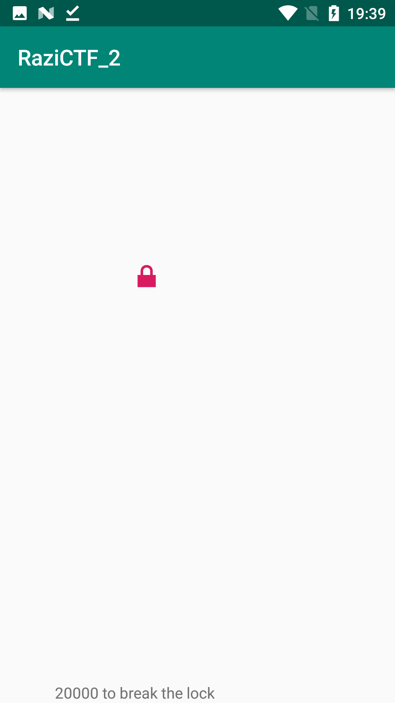
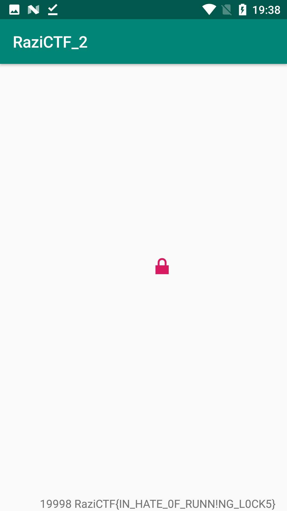

# Write-up: Chasing a Lock


## Description

### My Story
First I executed the app and this is it:



Each time you touch the lock, the counter at the bottom of the page will decrease by one; while the lock changes its position randomly every second.

me: "So I should make the counter zero!" :D

I got the point and opened JADX and found the source code without any obfuscation. This is the source code of MainActivity:
```
package com.example.razictf_2;

import android.os.Bundle;
import android.util.DisplayMetrics;
import android.view.View;
import android.view.View.OnClickListener;
import android.widget.ImageButton;
import android.widget.TextView;
import androidx.appcompat.app.AppCompatActivity;
import java.util.Random;
import java.util.Timer;
import java.util.TimerTask;

public class MainActivity extends AppCompatActivity {
    public void onCreate(Bundle bundle) {
        super.onCreate(bundle);
        setContentView((int) R.layout.activity_main);
        final ImageButton imageButton = (ImageButton) findViewById(R.id.my_button);
        final DisplayMetrics displayMetrics = new DisplayMetrics();
        getWindowManager().getDefaultDisplay().getMetrics(displayMetrics);
        new Timer().schedule(new TimerTask() {
            public void run() {
                MainActivity.this.runOnUiThread(new Runnable() {
                    public void run() {
                        Random random = new Random();
                        float nextFloat = random.nextFloat() * ((float) displayMetrics.widthPixels);
                        float nextFloat2 = random.nextFloat() * ((float) displayMetrics.heightPixels);
                        new Timer();
                        imageButton.animate().x(nextFloat).y(nextFloat2).setDuration(0).start();
                    }
                });
            }
        }, 0, 1000);
        imageButton.setOnClickListener(new OnClickListener() {
            public void onClick(View view) {
                TextView textView = (TextView) MainActivity.this.findViewById(R.id.Num);
                int parseInt = Integer.parseInt(textView.getText().toString());
                if (parseInt == 0 || parseInt < 0) {
                    textView.setText("0");
                    return;
                }
                int i = parseInt - 1;
                String run = new switcher().run(i);
                if (run != null) {
                    ((TextView) MainActivity.this.findViewById(R.id.Flag)).setText(run);
                }
                textView.setText(String.valueOf(i));
            }
        });
    }
}
```

And this is the interesting point:
```
String run = new switcher().run(i);
```

It seems the magic part is inside the `switcher` class. This is the source code:
```
package com.example.razictf_2;

public class switcher {
    public String run(int i) {
        if (i != 0) {
            return null;
        }
        a1 a1Var = new a1();
        StringBuilder sb = new StringBuilder();
        sb.append(" ");
        sb.append(a1Var.run(i));
        String sb2 = sb.toString();
        a2 a2Var = new a2();
        System.out.println(a2Var.run(i));
        StringBuilder sb3 = new StringBuilder();
        sb3.append(sb2);
        sb3.append(a2Var.run(i));
        String sb4 = sb3.toString();
        a3 a3Var = new a3();
        StringBuilder sb5 = new StringBuilder();
        sb5.append(sb4);
        sb5.append(a3Var.run(i));
        String sb6 = sb5.toString();
        a4 a4Var = new a4();
        StringBuilder sb7 = new StringBuilder();
        sb7.append(sb6);
        sb7.append(a4Var.run(i));
        String sb8 = sb7.toString();
        a5 a5Var = new a5();
        StringBuilder sb9 = new StringBuilder();
        sb9.append(sb8);
        sb9.append(a5Var.run(i));
        return sb9.toString();
    }
}
```

### Exploit Time
So the only thing I need to do is hooking the `run` method and rewrite the value of `i` argument to zero. It's really easy using Frida.
I wrote [loader.py](./loader.py) and [script.js](./script.js).

### Flag
And this is the result:
