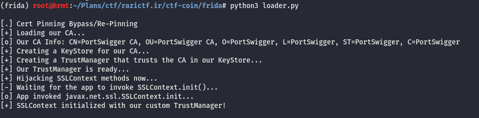

# Write-up: CTF Coin


## Description
There are some images in this directory of the app In-App Purchase (IAP) and ...

### My Story
First I thought it should be a problem of app itself! so I dived deep inside the app. I used static analysis to understand what it is doing. but it was somehow confusing and complicated. so I tried another way; dynamic analysis. I started Burp and trying to monitor the traffic.

but there was a problem! This error was occurring repeatedly and I couldn't do the purchase while system proxy setting was set to my Burp IP! I had set the cert; so I didn't know the cause of the problem!
```
BurpSuite Error: failed to negotiate an SSL connection
```
I saw a new phrase I didn't know what is it; `SSL Pinning`. But I remembered a script from [codeshare.frida.re](https://codeshare.frida.re) named `Universal Android SSL Pinning Bypass with Frida`. So this is the solution to bypass this #&%^#@!



It took a lot of time to analyze statically and finding out the solution of `SSL Pinning` problem. But I learned a lot! :P

After bypassing SSL Pinning it was so easy to capture the traffic to the back-end server.


### Exploit Time
Then I sent another value as `coins` parameter:


### Flag
And this is the flag:

```
RaziCTF{ZmRzdnNkRlNEcWUzQFFxZURXRUZEU1ZGU0RTNTVkc2Y1ZmV2c0RGcnEzNSRSI3J3ZnNlZnJ3IyQjJSNA}
```